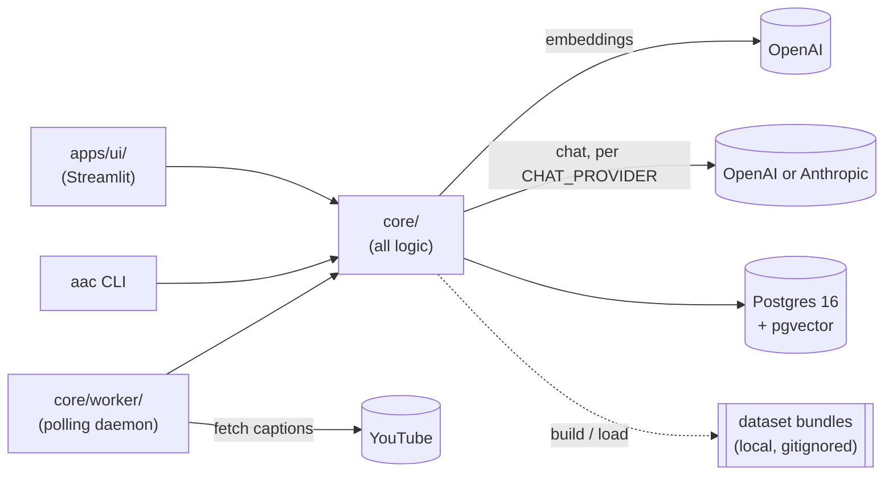

# AskAnyChannel

**Ask a YouTube channel anything.** AskAnyChannel ingests a channel's video transcripts and
answers only from what the videos actually say — every claim linked to the exact second it was
said. Self-hosted, your API keys, one `docker compose up`.

[](https://github.com/rokbenko/ask-any-channel/actions/workflows/ci.yml)
[](LICENSE)
[](CONTRIBUTING.md)

A real turn against three TED talks (`aac dataset build @TED --limit 3`), unedited apart from
trimming the answer to its first two paragraphs:

> **You:** How does play make people more creative and resilient?
>
> Play makes people more creative and resilient by activating parts of the brain associated
> with spontaneous and imaginative thinking, such as the default mode network. This brain
> activity occurs when people engage in playful behaviors like mind wandering and daydreaming,
> which are often mistaken for laziness but actually help the brain connect disparate ideas in
> novel ways **[1][5]**.
>
> Moreover, play involves doing things without a predetermined outcome, fostering intrinsic
> motivation and the freedom not to know the answer in advance. This openness leads to original
> ideas, deeper fulfillment, and stronger resilience **[2][3]** …
>
> **[1]** *How Play Boosts Your Creativity and Resilience | Katina Bajaj | TED* — 4:48 →
> <https://www.youtube.com/watch?v=LGb0_ed_euA&t=288s>
> **[2]** *same talk* — 0:09 → <https://www.youtube.com/watch?v=LGb0_ed_euA&t=9s>
> **[3]** *same talk* — 1:41 → <https://www.youtube.com/watch?v=LGb0_ed_euA&t=101s>
> **[5]** *same talk* — 6:21 → <https://www.youtube.com/watch?v=LGb0_ed_euA&t=381s>

Every `[n]` is a receipt: click it and YouTube opens at that second. In the UI it also expands
into an embedded player. That turn cost $0.0016 in API calls. Ask something the channel never
covers and you get an honest "the channel doesn't cover this" instead of an invented answer.

<!--
GIF storyboard (~20s), to record for docs/demo.gif and place right above this comment:
  0-3s   Paste a channel URL/@handle into the "Add a channel" form, hit submit.
  3-8s   Channel card shows live ingest progress (stage + done/total), auto-refreshing.
  8-11s  Card flips to "ready" the moment ingest finishes; click "Chat".
  11-15s Type a question, hit send — answer streams in with inline [n] citations.
  15-18s Click a citation; it expands to an embedded player.
  18-20s Player is seeked to the cited timestamp, YouTube opens there via the &t= link.
-->

## Quickstart

You need [Docker with Compose v2](https://docs.docker.com/compose/) (Docker Desktop, or Docker
Engine ≥ 24) and an [OpenAI API key](https://platform.openai.com/api-keys) — nothing else.
Works the same in bash, zsh, and PowerShell.

```bash
git clone https://github.com/rokbenko/ask-any-channel.git
cd ask-any-channel
cp .env.example .env
docker compose --profile ui up -d
```

Between steps 3 and 4, open `.env` in any editor and set `OPENAI_API_KEY=sk-...` (it's the only
required key — see [Configuration](#configuration)). The first `up` builds two images and
downloads ~200 MB of Python wheels; expect **3–6 minutes** the first time, seconds after that.

Then open <http://127.0.0.1:8501> → **Channels** → paste a channel URL or `@handle` → watch it
ingest live (progress updates on its own). When it flips to ready, hit **Chat**. Fetching runs
at roughly 12 s per video (measured; deliberately polite to YouTube), so a `--limit 20` first
channel is chatting in about 4 minutes.

Something off? `docker compose run --rm worker aac doctor` checks your config, database, keys,
and yt-dlp, and prints one actionable line per problem — never a stack trace. `docker compose
logs -f worker` shows what the ingest is doing.

## Contents

- [Features](#features)
- [How it works](#how-it-works)
- [Architecture](#architecture)
- [Configuration](#configuration)
- [Add your favorite creator](#add-your-favorite-creator)
- [FAQ](#faq)
- [Roadmap](#roadmap)
- [Contributing](#contributing)
- [Legal](#legal)
- [Reference](#reference): channel management · `aac` CLI · dataset bundles · chat · security
  notes

## Features

- **Answers with receipts.** Every response cites `[n]` markers to the exact video and
  timestamp (`youtube.com/watch?v={id}&t={seconds}s`), and expands into an embedded player
  seeked to that moment. Off-topic questions get an honest refusal, not an invented answer.
- **Self-hosted, bring-your-own-keys.** No accounts, no telemetry, no hosted tier. Your API
  keys, your Postgres, your machine. Loopback-only ports by default.
- **Cheap.** Ingesting a channel is cents in embeddings (20 TED talks ≈ 65k tokens ≈ $0.001);
  a chat turn is a fraction of a cent on the default model.
- **Incremental updates.** "Check for new videos" only processes what's new, so keeping a
  channel current costs almost nothing.
- **Shareable dataset bundles.** A build produces a portable, versioned bundle anyone can load
  with **zero API keys**; the community [registry](#add-your-favorite-creator) indexes what's
  already been built — metadata only, transcripts never leave your machine.
- **OpenAI or Anthropic for chat**, streaming, switchable per `CHAT_PROVIDER`; either can be
  pointed at a compatible endpoint you run yourself.
- **Diagnosable.** `aac doctor` explains a broken setup in one line per problem, and the worker
  and UI run the same checks at boot.

## How it works

1. **List** the channel's videos with yt-dlp (`@handle`, URL, or `UC…` id — YouTube hosts only).
2. **Fetch captions** per video (manual English preferred, auto-generated as fallback), cached
   as `.vtt` under `data/raw/`; politely rate-limited.
3. **Parse & chunk**: YouTube's rolling caption cues are de-duplicated word-by-word, keeping
   each word's timestamp, then chunked to ~400 tokens with overlap — so every chunk knows the
   second it starts.
4. **Embed** the chunks (`text-embedding-3-small`) and store them in Postgres + pgvector, all
   scoped by channel.
5. **Answer**: your question is embedded, the top matching chunks are retrieved, and the chat
   model is instructed to answer *only* from those chunks and to cite them as `[n]` — which the
   UI turns into timestamped links and players.

Steps 1–4 are also available as a portable **dataset bundle** (`aac dataset build`), which is
how channels get shared without sharing transcripts.

## Architecture



- **`core/`** — all logic: ingestion, chunking, retrieval, chat orchestration + citation
  parsing, job lifecycle (enqueue/dedupe/retry/cancel), provider + credentials seams, dataset
  bundling, environment diagnostics (`core/doctor.py`).
- **`cli/`** — the `aac` Typer CLI (`ingest`, `search`, `status`, `worker`, `doctor`,
  `dataset`, `registry`) — an advanced/contributor path; the browser UI covers the everyday
  flow.
- **`core/db/`** — connection pool plus plain numbered SQL migrations and a small
  dependency-light runner (applied lazily on the first database touch, logged when they run).
- **`apps/ui/`** — Streamlit app; imports `core` only, zero logic of its own. `Home.py` is
  chat, `pages/1_Channels.py` is add/manage/delete.
- **`core/worker/`** — the polling ingest daemon (`aac worker`) that channel-add/update
  actions in the UI enqueue work for; shares pipeline code with the CLI's inline path.
- One database for everything: relational data, vectors (pgvector), and the ingestion job
  queue — no Pinecone, no Redis.

```
├── cli/                # aac Typer CLI — thin wrappers over core/
├── core/
│   ├── ingest/         # channel resolution, caption fetch, VTT parsing, chunking, job lifecycle
│   ├── dataset/        # local bundle build/load/validate + registry entries
│   ├── db/             # connection pool + numbered SQL migrations (applied lazily)
│   ├── providers/      # LLMProvider seam — OpenAI + Anthropic, chosen via CHAT_PROVIDER
│   ├── store/          # VectorStore seam, pgvector implementation
│   ├── search/         # retrieval
│   ├── chat/           # grounded prompt, streaming answer, [n] citations, suggested questions
│   ├── worker/         # polling daemon, shares pipeline code with the CLI
│   └── doctor.py       # shared env/DB/key checks — `aac doctor` and boot-time validation
├── registry/           # channels.json (community index) + schema.json (its JSON Schema)
├── data/raw/           # cached .vtt captions (gitignored)
├── datasets/           # local dataset bundles (gitignored — see Dataset bundles)
├── apps/ui/            # Streamlit app: Home.py (chat), pages/1_Channels.py (manage)
└── tests/              # pytest — parsing/chunking/bundle/chat-orchestration/job/doctor logic
```

## Configuration

All settings come from `.env` (copy `.env.example` to start) via `core/config.py` (and
`core/credentials.py` for API keys) — no other module reads environment variables directly.

| Variable | Purpose |
| --- | --- |
| `OPENAI_API_KEY` | **The one required key.** Embeds transcripts and questions — always, regardless of `CHAT_PROVIDER` — and answers chat when `CHAT_PROVIDER=openai` (default). |
| `ANTHROPIC_API_KEY` | Required only when `CHAT_PROVIDER=anthropic`. |
| `CHAT_PROVIDER` | `openai` (default) or `anthropic` — which vendor answers chat turns. |
| `CHAT_MODEL` | Overrides the default chat model for the configured provider. Leave blank to use the built-in default. |
| `OPENAI_BASE_URL` / `ANTHROPIC_BASE_URL` | Point at any OpenAI-/Anthropic-compatible endpoint (self-hosted proxy, local server). For embeddings the endpoint must serve `text-embedding-3-small` at 1536 dims — see the [FAQ](#faq). |
| `POSTGRES_PASSWORD` | Password for the compose Postgres service (default `aac`). Change it for anything beyond a laptop, and keep `DATABASE_URL` in sync. |
| `DATABASE_URL` | Postgres connection string. The compose Postgres service is published on **`127.0.0.1:5432` only** — Docker port publishing bypasses host firewalls, so it's deliberately not reachable from the network. |
| `INSTANCE_MODE` | `selfhost` (default, no auth/quotas) or `cloud` (future, not built). |
| `RAW_CAPTIONS_DIR` | Where cached `.vtt` caption files are written (default `data/raw`). Gitignored, safe to delete. |

Releases are tagged `vX.Y.Z` on `main`; see [CHANGELOG.md](CHANGELOG.md). `aac --version`
prints the running version.

## Add your favorite creator

Anyone can build a dataset bundle for a channel and share it via the community registry, so
the next person doesn't have to re-fetch and re-embed it themselves. This is the CLI path, so
you'll need Python 3.11, [`uv`](https://docs.astral.sh/uv/), and Node.js on `PATH` (see
[Advanced: the `aac` CLI](#advanced-the-aac-cli)).

```bash
uv sync
docker compose up -d postgres
uv run aac dataset build @SomeChannel --limit 50
uv run aac registry entry @SomeChannel
```

Expect about **10 minutes for 50 videos** (≈12 s per video, measured on TED — fetching is
deliberately polite to YouTube) and **cents in embeddings** (`dataset build` prints the exact
estimate). `registry entry` prints a JSON object; paste it into `registry/channels.json` and
open a PR — CI validates it for you.

> [!WARNING]
> **Registry PRs are metadata-only.** Never commit anything from `datasets/` or `data/raw/` —
> transcript content must never enter the registry or git history. A registry entry contains
> only the channel id/handle/title, suggested build config, video/chunk counts, a
> last-verified date, and the contributor's name (see `core/dataset/registry.py`) — CI
> (`.github/workflows/registry.yml`) validates every PR against
> [`registry/schema.json`](registry/schema.json) and rejects anything that doesn't match this
> shape exactly.

## FAQ

**Which API keys do I need, and when?**
Loading someone else's bundle (`aac dataset load`) needs **no key**, as long as its embeddings
already match your configured model. Building a new bundle needs `OPENAI_API_KEY` (embeddings
only). Chatting always needs `OPENAI_API_KEY` (the question is embedded regardless of
`CHAT_PROVIDER`), plus `ANTHROPIC_API_KEY` only if `CHAT_PROVIDER=anthropic`.

**What does this cost?**
Embeddings are ~$0.02 per million tokens (`core/constants.py::EMBEDDING_COST_PER_1K_TOKENS_USD`)
— 20 TED talks came to ~65k tokens, about a tenth of a cent. Chat depends on the model
(`CHAT_MODEL_PRICING_USD`); the demo turn above was $0.0016 on `gpt-4.1-mini`. Both figures are
estimates — check each vendor's pricing page.

**Can I use local or self-hosted models?**
For **chat**, yes: set `OPENAI_BASE_URL` (Ollama's OpenAI-compatible server, vLLM, LiteLLM, an
internal proxy) or `ANTHROPIC_BASE_URL`. For **embeddings**, the model name and dimension are
fixed in `core/constants.py` (`text-embedding-3-small`, 1536), so the endpoint must serve that
model — a LiteLLM alias works; Ollama does not out of the box. Making the embedding model
configurable is on the roadmap.

**Why is fetching slow?**
Deliberate: a pause between videos plus retry backoff, so a 300-video channel doesn't hammer
YouTube. Measured at ~12 s per video. Use `--limit` to build a smaller slice first; incremental
updates later only fetch what's new.

**Every video comes back `no_captions`.**
Two usual causes: Node.js isn't on `PATH` (yt-dlp needs a JS runtime — `aac doctor` checks
this; the Docker image bundles it), or yt-dlp is out of date after a YouTube change. Update it
with `uv lock --upgrade-package yt-dlp` and rebuild (`docker compose build`). `aac doctor`
prints the installed yt-dlp version so you can compare with the latest release.

**Something's broken.**
`docker compose run --rm worker aac doctor` (or `uv run aac doctor` on the CLI path) checks
env vars, database reachability and migrations, data-directory permissions,
embedding-dimension consistency, API keys, and yt-dlp/Node.js, and prints one actionable line
per problem. `docker compose ps` shows the same checks as container health, and `docker compose
logs -f worker` shows the ingest. Paste the doctor output into a bug report — it redacts your
database password.

## Roadmap

- **v0.1** (this release): cited chat, channel management UI, worker with crash recovery,
  dataset bundles + registry, `aac doctor`.
- **Next:** a public demo instance; a seeded registry; prebuilt images on GHCR so `docker
  compose up` pulls instead of builds.
- **v0.2:** hybrid retrieval (full-text + vector fusion), an HTTP API, per-channel persona
  configuration, scheduled auto-ingest, configurable embedding model.
- Ideas and votes welcome in [issues](https://github.com/rokbenko/ask-any-channel/issues).

## Contributing

PRs and registry entries are welcome. [CONTRIBUTING.md](CONTRIBUTING.md) has the five-minute
dev setup, the test/lint commands CI runs, the architecture rules (all logic in `core/`, thin
UI/CLI), and the DCO sign-off (`git commit -s`). Please read
[CODE_OF_CONDUCT.md](CODE_OF_CONDUCT.md); report security issues per [SECURITY.md](SECURITY.md).

## Legal

This project automates access to YouTube's website (via `yt-dlp`) to fetch publicly available
caption data. That may be against YouTube's Terms of Service depending on your jurisdiction
and how you use it — **running this tool is the operator's responsibility**, same posture as
`yt-dlp` itself; this project provides the tool, not legal cover.

**Not affiliated with YouTube, Google, or any creator featured.** Every assistant answers
questions about a channel's public video content — it never impersonates the creator or
claims to speak as them.

**Takedown requests:** contact **roksstartups@gmail.com**. A registry entry (metadata only —
see [Add your favorite creator](#add-your-favorite-creator)) will be removed the same day a
valid request is received. Transcript content itself is never hosted or committed by this
project in the first place.

Licensed under **Apache License 2.0** — contributions are accepted under the [Developer
Certificate of Origin](https://developercertificate.org/) (`git commit -s`); see
[CONTRIBUTING.md](CONTRIBUTING.md).

---

## Reference

### Channel management

The **Channels** page (`apps/ui/pages/1_Channels.py`) is the everyday way to add and manage
channels:

- **Add a channel** — paste a URL/`@handle`, pick a video limit and sort order, submit. This
  enqueues an ingest job; the `worker` service picks it up and processes it.
- **Live progress** — each channel card auto-refreshes while a job is queued/running, showing
  the current stage and a `done/total` count, with no page reload needed.
- **Chat** — jumps to Home with that channel selected.
- **Check for new videos** — enqueues an incremental update: only videos not already in the
  channel are processed, so it's cheap even on a large channel.
- **Delete** — type-to-confirm hard delete: removes the channel's videos/chunks/chats/messages
  and every local dataset bundle whose manifest names that channel. Past `usage_events` for
  that channel are preserved (for future billing/attribution), just detached from the deleted
  channel.
- A failed job shows its error with a **Retry** button; a queued job can be **Cancelled**. A
  channel that hasn't resolved yet (or never will — a typo'd handle) shows under **Pending
  adds** with the same controls. Only one job runs per channel at a time — adding an
  already-ingesting channel is rejected with a clear message, and that's enforced in the
  database, not just the form.
- If a queued job sits unclaimed, the page says so — usually meaning no worker is running
  (`docker compose up -d worker` or `uv run aac worker`).
- Only YouTube channel inputs are accepted (`youtube.com`/`youtu.be` URLs, `@handles`,
  `UC…` ids); the video limit is capped server-side (1000) so a slip of the keyboard can't
  become a very large embedding bill.
- A worker that dies mid-job (container restart, OOM) is noticed by the next worker poll: the
  job is requeued and resumes; after 3 such deaths it's marked failed with a clear message
  rather than re-embedding forever.

### Advanced: the `aac` CLI

Everything above is also available from the command line — useful for scripting, CI, or
building a dataset bundle to share via the [registry](#add-your-favorite-creator) without
running the full UI stack. Needs Python 3.11 (`>=3.11,<3.12`), [`uv`](https://docs.astral.sh/uv/),
and **Node.js** (yt-dlp needs a JS runtime for full extraction, captions included — the
`worker` Docker image already bundles it, but running ingestion commands directly on your host
needs Node on `PATH`). None of this pulls Node/TypeScript into the app itself — `core/` is
pure Python.

```bash
docker compose up -d postgres
uv sync
uv run aac ingest @SomeChannel --limit 20
uv run aac search "what does this channel say about X?" --channel @SomeChannel
```

| Command | Does |
| --- | --- |
| `aac ingest <channel> [--limit N] [--sort views\|recent]` | Lists channel videos, fetches captions, chunks transcripts, embeds, and stores them directly in Postgres. Idempotent — re-runs skip already-completed work. |
| `aac search "<question>" --channel <handle> [--top-k 8]` | Prints the top matching transcript chunks with a score, video title, and a timestamped YouTube link (`&t={seconds}s`) that lands where the words are spoken. |
| `aac status` | Channels, per-status video counts, recent ingest job states. |
| `aac worker` | Runs the polling ingest daemon in the foreground — claims queued jobs and processes them. What the `worker` compose service runs; exits cleanly on SIGTERM/SIGINT. |
| `aac doctor [--quiet] [--role all\|worker\|ui]` | Checks env vars, database reachability/migrations, data-directory permissions, embedding-dimension consistency, API keys, and the yt-dlp/Node.js runtime; prints app/Python/yt-dlp versions first. Exits non-zero on any failure. `--role` selects the subset a given process needs — the compose healthchecks run `--quiet --role worker|ui`. |
| `aac --version` | Prints the version. |
| `aac dataset build <channel> [--limit N] [--sort views\|recent] [--out DIR] [--skip-embeddings]` | Builds a local, portable dataset bundle (videos, chunks, embeddings, manifest) without touching Postgres. Whole-bundle idempotent — rerunning a finished build is a no-op. |
| `aac dataset load <bundle_dir>` | Loads a previously built bundle into Postgres. Only calls an embedding API if the bundle's model doesn't match your configured one, or embeddings were skipped at build time. |
| `aac dataset validate <bundle_dir>` | Checks a bundle's manifest and files for integrity. |
| `aac registry entry <handle>` | Emits a metadata-only JSON entry (channel, suggested build config, video/chunk counts — never transcript content) for `registry/channels.json`, ready to paste into a PR. |

`channel` accepts a full channel URL, an `@handle`, or a bare `UC...` id. In PowerShell, quote
handles (`'@TED'`) — a bare `@` is splatting syntax there.

### Dataset bundles

`aac dataset build` produces a self-contained, shareable bundle (`manifest.json`,
`videos.jsonl`, `chunks.parquet`, and — unless `--skip-embeddings` is passed —
`embeddings-{model}.parquet`) under `datasets/{channel-slug}/`. Bundles are **local-only**
and gitignored: nothing under `datasets/` is ever committed, so no transcript content leaves
your machine unless you choose to share the directory yourself.

`registry/channels.json` is a public, metadata-only index (channel, suggested build config,
video/chunk counts — no transcript text) of channels the community has already built bundles
for; `registry/schema.json` is the JSON Schema every entry (and every registry PR, via CI)
must validate against. After a build, `aac registry entry <handle>` prints the entry to add
there in a PR, so others can find a channel worth re-ingesting themselves.

### Chat

Once a channel is ingested (see [Channel management](#channel-management) or `aac ingest`
above), chat with it in the Streamlit UI (`uv sync --extra ui && uv run streamlit run
apps/ui/Home.py`, or via `docker compose --profile ui up -d`, already running if you followed
the quickstart).

Pick a channel from the sidebar, ask a question, and get a streamed answer with inline
`[n]` citations — each links to the exact video + timestamp and expands to an embedded
player that starts right there. Off-topic questions get an honest "the channel doesn't
cover this" instead of an invented answer. A fresh chat shows a handful of clickable
suggested starter questions, generated from the channel's most-watched videos with one small
chat call once a chat key is available (at ingest time if one's configured — never for
`aac dataset build --skip-embeddings` — lazily on the first visit otherwise). Questions that
travel inside a shared bundle are validated and sanitized on load like every other bundle
field.

`CHAT_PROVIDER` (`openai` or `anthropic`) picks which vendor answers chat turns;
`CHAT_MODEL` overrides the default model for that provider. Embedding the question always
goes through OpenAI regardless of `CHAT_PROVIDER`, so `OPENAI_API_KEY` is required either
way — set `ANTHROPIC_API_KEY` too if `CHAT_PROVIDER=anthropic`.

The UI has **no login** in self-host mode and every question is billed to *your* API keys, so
it listens on `localhost` only (`.streamlit/config.toml`; the compose service publishes on
`127.0.0.1:8501` for the same reason). Put it behind a reverse proxy with authentication if
you need it reachable from elsewhere. Streamlit's usage telemetry is switched off there too.

### Compose services and health

`docker compose --profile ui up -d` runs three services: `postgres` (pgvector, loopback-only),
`worker` (the polling ingest daemon), and `ui` (Streamlit, loopback-only on `8501`). `worker`
and `ui` wait for Postgres to be healthy, run `aac doctor --role worker|ui` at boot (a failing
check logs one line and exits, and `restart: unless-stopped` retries with backoff — read
`docker compose logs worker`), and report the same checks as container health every minute
(`docker compose ps`). Note that Compose only *reports* health; it doesn't restart an unhealthy
container. Containers run as uid 1000 with `data/` and `datasets/` bind-mounted from the host —
both directories exist in a fresh clone so they're host-owned before the container touches them;
if your host user isn't uid 1000, `aac doctor` tells you the `chown` to run.

### Security notes for self-hosters

- **The worker fetches from YouTube only.** Channel inputs are restricted to `youtube.com` /
  `youtu.be` URLs, `@handles`, and `UC…` ids before a job is even queued, so the ingest form
  can't be used to make the worker fetch arbitrary URLs.
- **yt-dlp runs remote JavaScript.** Like the yt-dlp CLI, `core/` configures yt-dlp with a
  Node.js runtime and its official remote "EJS" challenge-solver components (downloaded from
  yt-dlp's GitHub at run time) — required for reliable YouTube extraction. That code executes
  inside the worker (container, if you use compose). If that's not acceptable in your
  environment, run the worker in an isolated network namespace and review `YTDLP_BASE_OPTS`
  in `core/constants.py`.
- **Community bundles are untrusted input.** `aac dataset load` validates ids, titles,
  thumbnail hosts, and suggested questions before anything reaches Postgres or the UI.
- **Non-root containers, loopback-only ports, no telemetry** — see
  [Compose services and health](#compose-services-and-health).
- Found a security issue? See [SECURITY.md](SECURITY.md) rather than opening a public issue.

## License

Apache License 2.0 — see [LICENSE](LICENSE).
