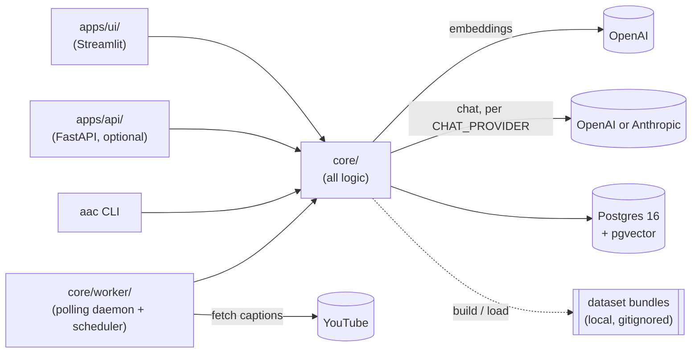

# AskAnyChannel

**Ask a YouTube channel anything.** AskAnyChannel ingests a channel's video transcripts and
answers only from what the videos actually say — every claim linked to the exact second it was
said. Ask several creators at once. Get the answer in one of their voices, with everyone else
still credited by name. Self-hosted, your API keys, one `docker compose up`.

[](https://github.com/rokbenko/ask-any-channel/actions/workflows/ci.yml)
[](LICENSE)
[](CONTRIBUTING.md)

A real turn against three TED talks (`aac dataset build @TED --limit 3`), unedited apart from
trimming the answer to its first two paragraphs:

> **You:** How does play make people more creative and resilient?
>
> Play makes people more creative and resilient by activating parts of the brain associated
> with spontaneous and imaginative thinking, such as the default mode network. This brain
> activity occurs when people engage in playful behaviors like mind wandering and daydreaming,
> which are often mistaken for laziness but actually help the brain connect disparate ideas in
> novel ways **[1][5]**.
>
> Moreover, play involves doing things without a predetermined outcome, fostering intrinsic
> motivation and the freedom not to know the answer in advance. This openness leads to original
> ideas, deeper fulfillment, and stronger resilience **[2][3]** …
>
> **[1]** *How Play Boosts Your Creativity and Resilience | Katina Bajaj | TED* — 4:48 →
> <https://www.youtube.com/watch?v=LGb0_ed_euA&t=288s>
> **[2]** *same talk* — 0:09 → <https://www.youtube.com/watch?v=LGb0_ed_euA&t=9s>
> **[3]** *same talk* — 1:41 → <https://www.youtube.com/watch?v=LGb0_ed_euA&t=101s>
> **[5]** *same talk* — 6:21 → <https://www.youtube.com/watch?v=LGb0_ed_euA&t=381s>

Every `[n]` is a receipt: click it and YouTube opens at that second. In the UI it also expands
into an embedded player. That turn cost $0.0016 in API calls. Ask something the channel never
covers and you get an honest "the channel doesn't cover this" instead of an invented answer.

## Quickstart

You need [Docker with Compose v2](https://docs.docker.com/compose/) (Docker Desktop, or Docker
Engine ≥ 24) and an [OpenAI API key](https://platform.openai.com/api-keys) — nothing else.
Works the same in bash, zsh, and PowerShell.

```bash
git clone https://github.com/rokbenko/ask-any-channel.git
cd ask-any-channel
cp .env.example .env
docker compose --profile ui up -d
```

Between steps 3 and 4, open `.env` in any editor and set `OPENAI_API_KEY=sk-...` (it's the only
required key — see [Configuration](#configuration)). The first `up` builds two images and
downloads ~200 MB of Python wheels; expect **3–6 minutes** the first time, seconds after that.

Then open <http://127.0.0.1:8501> → **Channels** → paste a channel URL or `@handle` → watch it
ingest live (progress updates on its own). When it flips to ready, hit **Chat**. Fetching runs
at roughly 12 s per video (measured; deliberately polite to YouTube), so a `--limit 20` first
channel is chatting in about 4 minutes.

Something off? `docker compose run --rm worker aac doctor` checks your config, database, keys,
and yt-dlp, and prints one actionable line per problem — never a stack trace. `docker compose
logs -f worker` shows what the ingest is doing.

Already running 0.1.x? Read [Upgrading from 0.1.x](#upgrading-from-01x) **before** you pull.

## Contents

- [What makes it different](#what-makes-it-different)
- [Features](#features)
- [How it works](#how-it-works)
- [Architecture](#architecture)
- [Configuration](#configuration)
- [Upgrading from 0.1.x](#upgrading-from-01x)
- [Add your favorite creator](#add-your-favorite-creator)
- [FAQ](#faq)
- [Known limitations](#known-limitations)
- [Roadmap](#roadmap)
- [Contributing](#contributing)
- [Legal](#legal)
- [Reference](#reference): channel management · `aac` CLI · dataset bundles · chat ·
  HTTP API · compose · security notes

## What makes it different

Most "chat with a YouTube channel" tools stop at one channel and a neutral summarizer.
AskAnyChannel splits a chat into two independent settings — and that's the whole product.

|  | What it is | Where it lives |
| --- | --- | --- |
| **Sources** | *Whose videos may be used as evidence.* Any subset of your ingested channels. | `chat_sources` table |
| **Voice** | *Who is talking.* Neutral, or exactly one of the selected creators. | `chats.voice_channel_id` (`NULL` = Neutral) |

They're orthogonal. Two sources with a neutral voice gives you a comparison. Two sources with
one creator's voice gives you that creator engaging with someone else's argument. Both are
editable on an already-open chat — widen Sources mid-conversation and the next turn uses them.

Illustrative shape of a two-source, one-voice turn (sources = Alex Hormozi + Dan Martell,
voice = Alex):

> Here's the deal — *[Alex's take, first person, cited to Alex's videos]* **[1][2]**. Now, Dan
> Martell would push back here: *[Dan's take, named before the point, third person, cited to
> Dan's videos]* **[5]**.
>
> *AI trained on Alex Hormozi's public videos — not Alex Hormozi.*

Four rules make that trustworthy rather than a party trick:

1. **Voice changes delivery, never substance.** Every sentence still comes from a retrieved
   transcript chunk. The voice profile is style only — tone, rhythm, catchphrases, how the
   creator names their own frameworks — derived from that channel's own videos by
   `aac persona build`.
2. **Attribution is a correctness rule, not a stylistic one.** Only the voice's own blocks may
   be spoken in the first person. Anyone else's point must be introduced *with their name,
   before the point*, in the third person, cited to their own blocks. The system prompt calls
   folding another creator's idea into "I"/"we" the one mistake it must never make.
3. **No source gets crowded out.** Retrieval is quota'd per selected source
   (`MIN_BLOCKS_PER_SOURCE = 3`), so a 1 000-video channel can't drown a 20-video one, and
   disagreements between sources must be stated as disagreements rather than blended into a
   fake consensus.
4. **Every voice discloses itself.** A voiced chat always shows *"AI trained on {name}'s public
   videos — not {name}."* Asked "are you {name}?" it answers no — it may answer in voice, but
   the answer is always no. That guardrail is appended to every persona and repeated as a
   top-level section of the prompt; it isn't something the operator can switch off.

And if you ask something your selected sources don't cover, you don't get a guess. You get an
honest "the selected sources don't cover this" — plus, if another channel you've *already
ingested but didn't select* looks like it does cover it, a one-click **"Add {name} to Sources
and re-ask"**. That check reuses the question's existing embedding, so it costs nothing extra.

## Features

- **Chat across creators, in whichever voice you pick.** Sources and Voice, as above — the
  signature feature. See [Chat: Sources and Voice](#chat-sources-and-voice).
- **Answers with receipts.** Every response cites `[n]` markers to the exact video and
  timestamp (`youtube.com/watch?v={id}&t={seconds}s`), and expands into an embedded player
  seeked to that moment. With more than one source, citations are labeled by creator.
- **Hybrid retrieval, on by default.** Vector search (pgvector) fused with Postgres full-text
  search by Reciprocal Rank Fusion — so exact names, numbers, and framework titles a channel
  says verbatim aren't lost to pure semantic similarity. `aac retrieval compare` prints both
  rankings side by side so you can judge it on your own corpus. Switch with `RETRIEVAL_MODE`.
- **Self-hosted, bring-your-own-keys.** No accounts, no telemetry, no hosted tier. Your API
  keys, your Postgres, your machine. Loopback-only ports by default.
- **Cheap.** Ingesting a channel is cents in embeddings (20 TED talks ≈ 65k tokens ≈ $0.001);
  a chat turn is a fraction of a cent on the default model.
- **Updates itself if you want.** "Check for new videos" is one click; per-channel
  **Auto-update** does it on a schedule with no extra process — the existing worker checks
  periodically, with a deterministic per-channel offset so 40 channels on a 24 h interval don't
  all fire at once. Off per channel by default (`AUTO_INGEST_INTERVAL_HOURS`).
- **Shareable dataset bundles.** A build produces a portable, versioned bundle anyone can load
  with **zero API keys**; the community [registry](#add-your-favorite-creator) is the
  metadata-only index of what's been built. Transcripts never leave your machine, and voice
  profiles are instance-local and never included.
- **OpenAI or Anthropic for chat**, streaming, switchable per `CHAT_PROVIDER`; either can be
  pointed at a compatible endpoint you run yourself.
- **Embed it anywhere.** An optional FastAPI HTTP API streams the same grounded, multi-source,
  voiced answers over SSE — the Streamlit UI is one client of `core`, not the only one. See
  [HTTP API](#http-api) and [docs/api.md](docs/api.md).
- **Diagnosable.** `aac doctor` explains a broken setup in one line per problem, and every
  process (worker, UI, API) runs the same checks at boot and as its container healthcheck.

## How it works

1. **List** the channel's videos with yt-dlp (`@handle`, URL, or `UC…` id — YouTube hosts only).
2. **Fetch captions** per video (manual English preferred, auto-generated as fallback), cached
   as `.vtt` under `data/raw/`; politely rate-limited.
3. **Parse & chunk**: YouTube's rolling caption cues are de-duplicated word-by-word, keeping
   each word's timestamp, then chunked to ~400 tokens with overlap — so every chunk knows the
   second it starts.
4. **Embed** the chunks (`text-embedding-3-small`) and store them in Postgres + pgvector, all
   scoped by channel. Postgres also maintains a generated `tsvector` column over the same
   chunks for the lexical half of retrieval.
5. **Retrieve**: your question is embedded once, then searched against each selected source
   under its own quota. In `hybrid` mode (the default) each search runs a vector arm and a
   full-text arm and fuses their rankings; in `dense` mode it's vector-only.
6. **Answer**: the chat model is given those chunks, grouped and numbered per creator, and
   instructed to answer *only* from them, to cite `[n]`, and to attribute every claim to the
   creator it came from — which the UI turns into timestamped links and players.

Steps 1–4 are also available as a portable **dataset bundle** (`aac dataset build`), which is
how channels get shared without sharing transcripts.

## Architecture



- **`core/`** — all logic: ingestion, chunking, hybrid retrieval, chat orchestration (multi-
  source scope + voice) + citation parsing, corpus-derived voice profiles, job lifecycle
  (enqueue/dedupe/retry/cancel/auto-update scheduling), provider + credentials seams, dataset
  bundling, environment diagnostics (`core/doctor.py`).
- **`cli/`** — the `aac` Typer CLI (`ingest`, `search`, `retrieval compare`, `status`, `worker`,
  `doctor`, `persona`, `dataset`, `registry`) — an advanced/contributor path; the browser UI
  covers the everyday flow.
- **`core/db/`** — connection pool plus plain numbered SQL migrations and a small
  dependency-light runner (applied lazily on the first database touch, logged when they run).
- **`apps/ui/`** — Streamlit app; imports `core` only, zero logic of its own. `Home.py` is
  chat, `pages/1_Channels.py` is add/manage/delete.
- **`apps/api/`** — optional FastAPI shell over the same `core` (same rule: zero logic of its
  own); off by default, opt in with `docker compose --profile api up -d`. See
  [docs/api.md](docs/api.md).
- **`core/worker/`** — the polling ingest daemon (`aac worker`) that channel-add/update
  actions in the UI enqueue work for, plus the auto-update scheduler that runs inside the same
  loop; shares pipeline code with the CLI's inline path.
- One database for everything: relational data, vectors (pgvector), full-text (tsvector), and
  the ingestion job queue — no Pinecone, no Redis.

The one-way import rule (`cli/` and `apps/` import `core`; `core` imports neither, and the two
apps never import each other or a vendor SDK) is enforced by an AST-parsing test, not by
convention — which is what makes the UI and the HTTP API genuinely interchangeable clients.

```
├── cli/                # aac Typer CLI — thin wrappers over core/
├── core/
│   ├── ingest/         # channel resolution, caption fetch, VTT parsing, chunking, job lifecycle
│   ├── dataset/        # local bundle build/load/validate + registry entries
│   ├── db/             # connection pool + numbered SQL migrations (applied lazily)
│   ├── providers/      # LLMProvider seam — OpenAI + Anthropic, chosen via CHAT_PROVIDER
│   ├── store/          # VectorStore seam, pgvector implementation
│   ├── search/         # hybrid (vector + full-text) retrieval, dense/hybrid comparison
│   ├── persona/        # corpus-derived per-channel voice profiles, instance-only
│   ├── chat/           # scope (sources+voice), grouped prompt, streaming answer, [n] citations
│   ├── worker/         # polling daemon + auto-update scheduler, shares pipeline code with the CLI
│   └── doctor.py       # shared env/DB/key checks — `aac doctor` and boot-time validation
├── registry/           # channels.json (community index) + schema.json (its JSON Schema)
├── data/raw/           # cached .vtt captions (gitignored)
├── datasets/           # local dataset bundles (gitignored — see Dataset bundles)
├── apps/ui/            # Streamlit app: Home.py (chat), pages/1_Channels.py (manage)
├── apps/api/           # optional FastAPI shell — same core, no logic of its own
├── docs/               # docs/api.md — the HTTP API reference
└── tests/              # pytest — parsing/chunking/bundle/chat/scope/persona/job/API logic
```

## Configuration

All settings come from `.env` (copy `.env.example` to start) via `core/config.py` (and
`core/credentials.py` for API keys) — no other module reads environment variables directly.
A blank value (`OPENAI_BASE_URL=` with nothing after it) is treated as unset, not as `""`.

| Variable | Purpose |
| --- | --- |
| `OPENAI_API_KEY` | **The one required key.** Embeds transcripts and questions — always, regardless of `CHAT_PROVIDER` — and answers chat when `CHAT_PROVIDER=openai` (default). |
| `ANTHROPIC_API_KEY` | Required only when `CHAT_PROVIDER=anthropic`. |
| `CHAT_PROVIDER` | `openai` (default) or `anthropic` — which vendor answers chat turns. |
| `CHAT_MODEL` | Overrides the default chat model for the configured provider (`gpt-4.1-mini` / `claude-sonnet-5`). Leave blank to use the built-in default. |
| `RETRIEVAL_MODE` | `hybrid` (default) fuses vector + full-text search with RRF — better for exact names, numbers, and framework titles. `dense` is vector-only. Anything else fails at startup with one line. |
| `OPENAI_BASE_URL` / `ANTHROPIC_BASE_URL` | Point at any OpenAI-/Anthropic-compatible endpoint (self-hosted proxy, local server). For embeddings the endpoint must serve `text-embedding-3-small` at 1536 dims — see the [FAQ](#faq). |
| `POSTGRES_PASSWORD` | Password for the compose Postgres service (default `aac`). Change it for anything beyond a laptop, and keep `DATABASE_URL` in sync. |
| `DATABASE_URL` | Postgres connection string. The compose Postgres service is published on **`127.0.0.1:5432` only** — Docker port publishing bypasses host firewalls, so it's deliberately not reachable from the network. |
| `INSTANCE_MODE` | `selfhost` (default, no auth/quotas) or `cloud` (future, not built). |
| `RAW_CAPTIONS_DIR` | Where cached `.vtt` caption files are written (default `data/raw`). Gitignored, safe to delete. |
| `API_TOKEN` | Optional bearer token for the HTTP API. Unset (default) = open. Set = `POST /chats`, `POST /chats/{id}/messages`, and `POST /ask` require `Authorization: Bearer <token>`; `GET /channels*` stays open either way. See [HTTP API](#http-api) before using it for a public embed. |
| `CORS_ORIGINS` | Comma-separated origins the HTTP API accepts cross-origin browser requests from. Empty (default) = none. |
| `AUTO_INGEST_INTERVAL_HOURS` | How often the worker checks channels with "Auto-update" enabled for new videos (default 24; `0` disables it globally). Per-channel auto-update itself defaults off — toggle it on the Channels page. |

Tuning constants that are deliberately *not* env vars — chunk size, embedding model and
dimension, RRF `k`, per-source retrieval quotas, job retry limits, scheduler jitter — live in
`core/constants.py`, one file, each with a comment explaining the number.

Releases are tagged `vX.Y.Z` on `main`; see [CHANGELOG.md](CHANGELOG.md). `aac --version`
prints the running version.

## Upgrading from 0.1.x

> [!IMPORTANT]
> **Back up before you start the 0.2.0 containers.** Migrations `0006`–`0008` apply
> **automatically** the first time any 0.2.0 process touches the database — no prompt, no
> manual step, and one of them cannot be reversed.

```bash
docker compose exec -T postgres pg_dump -U aac askanychannel > backup-0.1.sql
```

- **`0007` is not reversible.** It backfills each chat's channel into the new `chat_sources`
  table and then **drops `chats.channel_id`**. Going back to 0.1.x afterwards means restoring
  the dump above — 0.1.x cannot read the 0.2.0 schema.
- **`0006` rewrites the whole `chunks` table.** Adding the generated `tsvector` column forces a
  full table rewrite under an exclusive lock, then builds a GIN index. On a large corpus expect
  the first start to block for minutes and to need roughly double the `chunks` table's disk
  while it runs. **Let it finish** — interrupting a migration is far worse than waiting.
- `0008` adds two nullable/defaulted columns to `channels`; it's instant.

Nothing else about the upgrade is breaking: existing chats keep their history and citations,
dataset bundles built by 0.1.x still load unchanged (`schema_version` is still `1`), and every
0.1.x CLI command keeps its behaviour. Your existing single-channel chats become one-source
chats, with the voice pre-selected where that channel's persona is enabled.

## Add your favorite creator

Anyone can build a dataset bundle for a channel and share it via the community registry, so
the next person doesn't have to re-fetch and re-embed it themselves. This is the CLI path, so
you'll need Python 3.11, [`uv`](https://docs.astral.sh/uv/), and Node.js on `PATH` (see
[Advanced: the `aac` CLI](#advanced-the-aac-cli)).

```bash
uv sync
docker compose up -d postgres
uv run aac dataset build @SomeChannel --limit 50
uv run aac registry entry @SomeChannel
```

Expect about **10 minutes for 50 videos** (≈12 s per video, measured on TED — fetching is
deliberately polite to YouTube) and **cents in embeddings** (`dataset build` prints the exact
estimate). `registry entry` prints a JSON object; paste it into `registry/channels.json` and
open a PR — CI validates it for you.

`registry/channels.json` is **empty today** — this is a fresh project and nobody has contributed
an entry yet. Yours can be the first; there's a
[dedicated issue template](.github/ISSUE_TEMPLATE/new_creator.md) if you'd rather suggest a
channel than build it.

> [!WARNING]
> **Registry PRs are metadata-only.** Never commit anything from `datasets/` or `data/raw/` —
> transcript content must never enter the registry or git history. A registry entry contains
> only the channel id/handle/title, suggested build config, video/chunk counts, a
> last-verified date, and the contributor's name (see `core/dataset/registry.py`) — CI
> (`.github/workflows/registry.yml`) validates every PR against
> [`registry/schema.json`](registry/schema.json), which sets `additionalProperties: false`
> and rejects anything that doesn't match this shape exactly.

## FAQ

**What's the difference between Sources and Voice?**
**Sources** decide *what evidence is allowed* — which channels' transcripts can be retrieved and
cited this turn. **Voice** decides *who is speaking* — Neutral, or one of those sources
answering in the first person in their own style. Changing Voice never changes which facts are
available or who they belong to; it only changes delivery. You can select five sources and keep
Voice on Neutral, or select five and speak as one of them. See
[Chat: Sources and Voice](#chat-sources-and-voice).

**Which API keys do I need, and when?**
Loading someone else's bundle (`aac dataset load`) needs **no key**, as long as its embeddings
already match your configured model. Building a new bundle needs `OPENAI_API_KEY` (embeddings
only). Chatting always needs `OPENAI_API_KEY` (the question is embedded regardless of
`CHAT_PROVIDER`), plus `ANTHROPIC_API_KEY` only if `CHAT_PROVIDER=anthropic`. Building a voice
profile needs whichever chat key `CHAT_PROVIDER` points at.

**What does this cost?**
Embeddings are ~$0.02 per million tokens (`core/constants.py::EMBEDDING_COST_PER_1K_TOKENS_USD`)
— 20 TED talks came to ~65k tokens, about a tenth of a cent. Chat depends on the model
(`CHAT_MODEL_PRICING_USD`); the demo turn above was $0.0016 on `gpt-4.1-mini`. Every turn writes
a `usage_events` row, so `SELECT SUM(est_cost_usd) FROM usage_events` is your actual running
total. All figures are estimates — check each vendor's pricing page.

**Can I use local or self-hosted models?**
For **chat**, yes: set `OPENAI_BASE_URL` (Ollama's OpenAI-compatible server, vLLM, LiteLLM, an
internal proxy) or `ANTHROPIC_BASE_URL`. For **embeddings**, the model name and dimension are
fixed in `core/constants.py` (`text-embedding-3-small`, 1536), so the endpoint must serve that
model — a LiteLLM alias works; Ollama does not out of the box. Making the embedding model
configurable is on the roadmap.

**Does hybrid retrieval actually beat plain vector search?**
Sometimes, and it depends entirely on your corpus and question. It's on by default because the
failure it fixes is a bad one — a channel's own product name or a specific number ranking below
generic paraphrases. But on a small corpus, or for a broadly-phrased question, dense search
often already ranks the right chunk first and fusion changes nothing. Rather than take a claim
on faith, run `aac retrieval compare "<your question>" --channels @yours`: it prints both
rankings with an "also in the other mode?" column, so you can see for yourself and set
`RETRIEVAL_MODE=dense` if hybrid isn't earning its keep for you.

**Why is fetching slow?**
Deliberate: a pause between videos plus retry backoff, so a 300-video channel doesn't hammer
YouTube. Measured at ~12 s per video. Use `--limit` to build a smaller slice first; incremental
updates later only fetch what's new.

**Every video comes back `no_captions`.**
Two usual causes: Node.js isn't on `PATH` (yt-dlp needs a JS runtime — `aac doctor` checks
this; the Docker image bundles it), or yt-dlp is out of date after a YouTube change. Update it
with `uv lock --upgrade-package yt-dlp` and rebuild (`docker compose build`). `aac doctor`
prints the installed yt-dlp version so you can compare with the latest release.

**Something's broken.**
`docker compose run --rm worker aac doctor` (or `uv run aac doctor` on the CLI path) checks
env vars, database reachability and migrations, data-directory permissions,
embedding-dimension consistency, API keys, and yt-dlp/Node.js, and prints one actionable line
per problem. `docker compose ps` shows the same checks as container health, and `docker compose
logs -f worker` shows the ingest. Paste the doctor output into a bug report — it redacts your
database password.

## Known limitations

Things this release genuinely doesn't do, stated plainly so you can decide before installing.

- **The registry is empty.** The infrastructure (schema, CI validation, `aac registry entry`)
  is in place, but no channel has been contributed yet. Today, "shareable bundles" means you
  can share them, not that there's a catalog to download from.
- **The HTTP API has no rate limit, no request quota, and no spend cap.** Every `/ask` spends
  *your* key, and there is no request body size limit either. If you expose it, gate abuse at a
  reverse proxy (nginx `limit_req`, Caddy `rate_limit`, Cloudflare) and set a hard monthly cap
  in your OpenAI/Anthropic dashboard — that cap is the only ceiling that can't be bypassed.
  Watch spend with
  `SELECT SUM(est_cost_usd) FROM usage_events WHERE created_at > now() - interval '1 day'`.
  `CORS_ORIGINS` restricts browsers; it is not a security boundary.
- **The embedding model is fixed** at `text-embedding-3-small` / 1536 dims (`core/constants.py`
  plus the migration's `vector(1536)`). Chat providers are pluggable; embeddings aren't yet.
  This also means a bundle built elsewhere only loads key-free if it used the same model.
- **Transcript text is untrusted input to the prompt.** The prompt states that context blocks
  are quoted transcript data and never instructions, and the honesty guardrail is repeated in
  two separate sections — but a video that literally narrates the prompt's block delimiters
  isn't structurally fenced out. Treat community bundles the way you'd treat any third-party
  content.
- **Auto-update is UI-only to enable.** There's no `aac` command to flip a channel's
  `auto_update` flag; use the Channels page (or SQL).
- **No hosted demo, no seeded content** — by design. You build your own datasets locally, which
  is also why nothing here needs a signup.
- **The browser UI is verified headlessly.** Streamlit's `AppTest` covers both pages including
  failure paths, but the citation expander and embedded player haven't been click-tested in a
  real browser in CI.

## Roadmap

- **v0.1:** cited chat, channel management UI, worker with crash recovery, dataset bundles +
  registry, `aac doctor`.
- **v0.2** (this release): hybrid retrieval (vector + full-text fusion), multi-source chat with
  per-creator voice profiles, an HTTP API for embedding the bot elsewhere, and a scheduled
  auto-update option per channel.
- **Next:** configurable embedding model; prebuilt images on GHCR so `docker compose up` pulls
  instead of builds; rate limiting and a spend cap for the HTTP API; the first registry entries.
- **Later — cloud mode** (hosted, multi-tenant): additive on top of the same `core`, not a
  rewrite. `apps/api/` already demonstrates that `core` is framework-agnostic and that a second
  client can be added without touching a line of it.
- Ideas and votes welcome in [issues](https://github.com/rokbenko/ask-any-channel/issues).

## Contributing

PRs and registry entries are welcome. [CONTRIBUTING.md](CONTRIBUTING.md) has the five-minute
dev setup, the test/lint commands CI runs, the architecture rules (all logic in `core/`, thin
UI/CLI, append-only migrations, don't bypass the seams), and the DCO sign-off (`git commit -s`).
Please read [CODE_OF_CONDUCT.md](CODE_OF_CONDUCT.md); report security issues per
[SECURITY.md](SECURITY.md).

## Legal

This project automates access to YouTube's website (via `yt-dlp`) to fetch publicly available
caption data. That may be against YouTube's Terms of Service depending on your jurisdiction
and how you use it — **running this tool is the operator's responsibility**, same posture as
`yt-dlp` itself; this project provides the tool, not legal cover.

**Not affiliated with YouTube, Google, or any creator featured.** Every assistant answers
questions about a channel's public video content. A voiced chat is an AI stand-in speaking in a
style derived from public videos — it discloses that in the interface, it never claims to be the
creator, and it answers "are you {name}?" honestly. Creators who'd rather not have a voice
profile built from their videos: see takedowns below.

**Takedown requests:** contact **roksstartups@gmail.com**. A registry entry (metadata only —
see [Add your favorite creator](#add-your-favorite-creator)) will be removed the same day a
valid request is received. Transcript content itself is never hosted or committed by this
project in the first place.

Licensed under **Apache License 2.0** — contributions are accepted under the [Developer
Certificate of Origin](https://developercertificate.org/) (`git commit -s`); see
[CONTRIBUTING.md](CONTRIBUTING.md).

---

## Reference

### Channel management

The **Channels** page (`apps/ui/pages/1_Channels.py`) is the everyday way to add and manage
channels:

- **Add a channel** — paste a URL/`@handle`, pick a video limit and sort order, submit. This
  enqueues an ingest job; the `worker` service picks it up and processes it.
- **Live progress** — each channel card auto-refreshes while a job is queued/running, showing
  the current stage and a `done/total` count, with no page reload needed.
- **Chat** — jumps to Home with that channel as the only source (and its default voice, if its
  persona is enabled) — you can widen Sources or change Voice from there.
- **Check for new videos** — enqueues an incremental update: only videos not already in the
  channel are processed, so it's cheap even on a large channel.
- **Auto-update** — a per-channel checkbox that lets the worker run that same incremental check
  on its own, every `AUTO_INGEST_INTERVAL_HOURS` (default 24, `0` disables it globally). Off by
  default. Each channel gets a deterministic offset derived from its own id, so many channels on
  one interval spread out instead of stampeding — and because that offset is a hash rather than
  a random number, restarting the worker doesn't re-roll it or re-trigger a check. A scheduled
  check also refreshes that channel's suggested questions, and regenerates its voice profile if
  the corpus has grown by 25% or more since the profile was built.
- **Voice** — enable/disable this channel's voice, mark it family-friendly, add custom
  instructions, edit the generated style profile by hand, or regenerate it from the channel's
  own transcripts (`aac persona build --force` does the same from the CLI).
- **Delete** — type-to-confirm hard delete: removes the channel's videos/chunks/messages and
  every local dataset bundle whose manifest names that channel. A chat scoped to more than this
  one channel survives with it removed from its sources (voice falls back to Neutral if it
  pointed here); a chat that had no other source is removed with it. Past `usage_events` are
  preserved (for future billing/attribution), just detached from the deleted channel.
- A failed job shows its error with a **Retry** button; a queued job can be **Cancelled**. A
  channel that hasn't resolved yet (or never will — a typo'd handle) shows under **Pending
  adds** with the same controls. Only one job runs per channel at a time — adding an
  already-ingesting channel is rejected with a clear message, and that's enforced in the
  database, not just the form.
- If a queued job sits unclaimed for 30 s, the page says so — usually meaning no worker is
  running (`docker compose up -d worker` or `uv run aac worker`).
- Only YouTube channel inputs are accepted (`youtube.com`/`youtu.be` URLs, `@handles`,
  `UC…` ids); the video limit is capped server-side (1000) so a slip of the keyboard can't
  become a very large embedding bill.
- A worker that dies mid-job (container restart, OOM) is noticed by the next worker poll: the
  job is requeued and resumes; after 3 such deaths it's marked failed with a clear message
  rather than re-embedding forever.

### Advanced: the `aac` CLI

Everything above is also available from the command line — useful for scripting, CI, or
building a dataset bundle to share via the [registry](#add-your-favorite-creator) without
running the full UI stack. Needs Python 3.11 (`>=3.11,<3.12`), [`uv`](https://docs.astral.sh/uv/),
and **Node.js** (yt-dlp needs a JS runtime for full extraction, captions included — the
`worker` Docker image already bundles it, but running ingestion commands directly on your host
needs Node on `PATH`). None of this pulls Node/TypeScript into the app itself — `core/` is
pure Python.

```bash
docker compose up -d postgres
uv sync
uv run aac ingest @SomeChannel --limit 20
uv run aac search "what does this channel say about X?" --channel @SomeChannel
```

| Command | Does |
| --- | --- |
| `aac ingest <channel> [--limit N] [--sort recent\|views]` | Lists channel videos, fetches captions, chunks transcripts, embeds, and stores them directly in Postgres. Idempotent — re-runs skip already-completed work. `--sort` defaults to `recent`. |
| `aac search "<question>" --channel <ref> [--top-k 8] [--mode hybrid\|dense]` | Prints the top matching transcript chunks with a score, video title, and a timestamped YouTube link (`&t={seconds}s`) that lands where the words are spoken. `--mode` defaults to `RETRIEVAL_MODE`. |
| `aac retrieval compare "<question>" --channels <a,b,...> [--top-k 8]` | Prints two tables — dense-only and hybrid — over the same channel set, with an "also in other mode?" column, so you can judge fusion on your own corpus. Always shows both; there's no `--mode`. |
| `aac persona build <channel> [--force]` | Samples the channel's own ingested transcripts (top-viewed videos plus a random spread) and asks the configured chat model for an editable style profile. Without `--force` it returns any existing profile untouched. Instance-only — never written into bundles or registry entries. |
| `aac status` | Channels (title, handle, per-status video counts, **Auto-update** on/off, **Last checked**) and recent ingest jobs (status, `done/total`, error, created). |
| `aac worker` | Runs the polling ingest daemon in the foreground — claims queued jobs, processes them, and ticks the auto-update scheduler. What the `worker` compose service runs; exits cleanly on SIGTERM/SIGINT. |
| `aac doctor [--quiet] [--role all\|worker\|ui\|api]` | Checks env vars, database reachability/migrations, data-directory permissions, embedding-dimension consistency, API keys, and the yt-dlp/Node.js runtime; prints app/Python/yt-dlp versions first. Exits non-zero on any failure. `--role` selects the subset a given process needs — the compose healthchecks run `--quiet --role worker\|ui\|api`. |
| `aac --version` | Prints `AskAnyChannel 0.2.0`. |
| `aac dataset build <channel> [--limit N] [--sort recent\|views] [--out DIR] [--skip-embeddings] [--force]` | Builds a local, portable dataset bundle (videos, chunks, embeddings, manifest) without touching Postgres. Whole-bundle idempotent — rerunning a finished build is a no-op unless `--force`. |
| `aac dataset load <bundle_dir>` | Loads a previously built bundle into Postgres. Only calls an embedding API if the bundle's model doesn't match your configured one, or embeddings were skipped at build time. |
| `aac dataset validate <bundle_dir>` | Checks a bundle's manifest and files for integrity. No DB, no keys. |
| `aac registry entry <handle>` | Emits a metadata-only JSON entry (channel, suggested build config, video/chunk counts — never transcript content) for `registry/channels.json`, ready to paste into a PR. Accepts a handle or a path to a built bundle. |

`channel` accepts a full channel URL, an `@handle`, or a bare `UC...` id. In PowerShell, quote
handles (`'@TED'`) — a bare `@` is splatting syntax there.

There is deliberately **no `aac api` command** — the HTTP API is a uvicorn app, see
[HTTP API](#http-api).

### Dataset bundles

`aac dataset build` produces a self-contained, shareable bundle (`manifest.json`,
`videos.jsonl`, `chunks.parquet`, and — unless `--skip-embeddings` is passed —
`embeddings-{model}.parquet`) under `datasets/{channel-slug}/`. Bundles are **local-only**
and gitignored: nothing under `datasets/` is ever committed, so no transcript content leaves
your machine unless you choose to share the directory yourself. Voice profiles, suggested
questions, and every other per-instance setting stay out of the bundle entirely — a bundle is
transcript content and nothing else, so loading one on a fresh instance never regenerates
someone else's voice or settings for you (run `aac persona build` yourself, once, locally).

`registry/channels.json` is a public, metadata-only index (channel, suggested build config,
video/chunk counts — no transcript text) of channels the community has built bundles for;
`registry/schema.json` is the JSON Schema every entry (and every registry PR, via CI) must
validate against. After a build, `aac registry entry <handle>` prints the entry to add there in
a PR, so others can find a channel worth re-ingesting themselves.

### Chat: Sources and Voice

Once a channel is ingested (see [Channel management](#channel-management) or `aac ingest`
above), chat with it in the Streamlit UI (`uv sync --extra ui && uv run streamlit run
apps/ui/Home.py`, or via `docker compose --profile ui up -d`, already running if you followed
the quickstart).

**Sources** is a multiselect over every channel you've ingested; all are selected by default.
It decides which transcripts may be retrieved and cited. Each selected source gets its own
retrieval quota, so adding a large channel doesn't starve a small one, and each source's blocks
are grouped and numbered separately in the prompt (`=== SOURCE — Title (@handle) — blocks
[1]–[4] ===`) so the model always knows whose words it's holding.

**Voice** is a dropdown containing *Neutral* plus every selected source whose persona is
enabled. Neutral speaks about the creators in the third person and imitates no one. Picking a
creator makes that creator's own material come out in the first person, in a style profile
derived from their videos — while every *other* selected creator's material stays in the third
person, introduced by name before the point, cited to their own blocks. Voice never adds a claim
that isn't in the retrieved text and never moves an idea from one creator to another.

Both are editable on an already-open chat, and the chats list shows each chat's scope and voice
as a caption. If you drop the voice channel out of Sources, the chat quietly falls back to
Neutral and tells you why rather than erroring.

Style profiles come from `aac persona build <channel>` (or "Regenerate voice" on the Channels
page). Generation samples the channel's top-viewed videos plus a random spread across the whole
catalog, and asks the configured chat model for a seven-section markdown profile — tone,
sentence rhythm, catchphrases, analogy habits, how they address the audience, profanity level,
and how they name their own frameworks. You can edit that profile by hand, add operator
instructions, or set "family-friendly" to keep the phrasing and drop the swearing. What you
*can't* remove is the honesty guardrail: every voice is told it is an AI and not the creator,
must answer "are you {name}?" honestly, and always displays *"AI trained on {name}'s public
videos — not {name}."* Voice profiles are instance-only — they never travel in a dataset bundle
or a registry entry, so nothing about how a creator "sounds" leaves your machine.

Answers stream with inline `[n]` citations; each expands to the video title, a timestamped
"Open on YouTube" link, and an embedded player seeked to that second. With more than one source
selected, citations are labeled with the creator they came from. Off-topic questions get an
honest "the selected sources don't cover this" instead of an invented answer, plus a button per
suggested channel to add it to Sources and re-ask the same question. A fresh chat shows a
handful of clickable starter questions blended round-robin across the selected channels,
generated with one small chat call (at ingest time if a chat key is configured — never for
`aac dataset build --skip-embeddings` — lazily on first visit otherwise). Questions that travel
inside a shared bundle are validated and sanitized on load like every other bundle field.

`CHAT_PROVIDER` (`openai` or `anthropic`) picks which vendor answers chat turns;
`CHAT_MODEL` overrides the default model for that provider. Embedding the question always
goes through OpenAI regardless of `CHAT_PROVIDER`, so `OPENAI_API_KEY` is required either
way — set `ANTHROPIC_API_KEY` too if `CHAT_PROVIDER=anthropic`.

The UI has **no login** in self-host mode and every question is billed to *your* API keys, so
it listens on `localhost` only (`.streamlit/config.toml`; the compose service publishes on
`127.0.0.1:8501` for the same reason). Put it behind a reverse proxy with authentication if
you need it reachable from elsewhere. Streamlit's usage telemetry is switched off there too.

### HTTP API

An optional FastAPI shell over the same `core` chat engine the UI uses — same retrieval, same
Sources/Voice scoping, same citations, streamed over SSE. It's the "embed the bot on your own
site" path. Full reference: [docs/api.md](docs/api.md).

```bash
docker compose --profile api up -d              # with the rest of the stack
# or, without Docker:
uv sync --extra api
uv run uvicorn apps.api.main:create_app --factory
```

`--factory` is required: there is deliberately no module-level `app`, so merely importing the
module can't trigger a real config load. Published on `127.0.0.1:8000` only; interactive
OpenAPI docs at <http://127.0.0.1:8000/docs>.

All endpoints live under `/api/v1`. A `{ref}` — including entries in `sources` and `voice` —
accepts an `@handle`, a bare handle, a full `UC…` id, or the channel's UUID.

| Method & path | Does |
| --- | --- |
| `GET /healthz` | Liveness only. |
| `GET /channels` · `GET /channels/{ref}` | Ingested channels: title, handle, video/chunk counts, suggested questions, persona state. |
| `POST /chats` | `{"sources": [ref, ...], "voice": ref\|null}` → a chat with that scope. 422 if the voice isn't a selected source or its persona is disabled. |
| `GET /chats/{id}` · `GET /chats/{id}/messages` | Current scope/voice/disclosure, and full history with citations. |
| `POST /chats/{id}/messages` | `{"question": "..."}` — SSE-streamed, persists both turns, same as the UI. |
| `POST /ask` | `{"sources": [...], "voice": ref\|null, "question": "..."}` — stateless one-shot; no chat row, nothing persisted but a usage record. |

```bash
curl -N -X POST http://127.0.0.1:8000/api/v1/ask \
  -H 'Content-Type: application/json' \
  -d '{"sources": ["@AlexHormozi", "@danmartell"],
       "voice": "@AlexHormozi",
       "question": "How should I price my offer?"}'
```

The response is zero or more `event: token` frames (`data: {"text": "<delta>"}`), then exactly
one closing frame — `event: done` carrying the full message, citations, usage/cost, the resolved
voice and its disclosure, and any suggested extra sources; or `event: error`. (`-N` disables
curl's buffering so you see tokens arrive.)

**Auth.** With `API_TOKEN` unset the API is open, matching the no-login self-host posture. Set
it and `POST /chats`, `POST /chats/{id}/messages`, and `POST /ask` all require
`Authorization: Bearer <token>`; `GET /channels` and `GET /channels/{ref}` stay open either way,
since an embed needs them to render a source picker and they return only public metadata.

> [!WARNING]
> **A public embed has to leave `API_TOKEN` unset** — a bearer token shipped to a browser is
> visible in the page source and authenticates nobody. There is no built-in rate limit, request
> quota, or spend cap, and every `/ask` spends your key. Gate abuse at a reverse proxy, cap the
> request body size there, and set a hard monthly limit in your vendor dashboard. See
> [Known limitations](#known-limitations).

### Compose services and health

`docker compose --profile ui up -d` runs three services: `postgres` (pgvector, loopback-only),
`worker` (the polling ingest daemon), and `ui` (Streamlit, loopback-only on `8501`). A fourth,
`api` (FastAPI, loopback-only on `8000`), is opt-in behind its own profile: `docker compose
--profile api up -d` (combine with `--profile ui` to run both). A bare `docker compose up`
starts `postgres` and `worker` only — enough for the CLI path, no browser UI.

`worker`/`ui`/`api` wait for Postgres to be healthy, run `aac doctor --role worker|ui|api` at
boot (a failing check logs one line and exits, and `restart: unless-stopped` retries with
backoff — read `docker compose logs worker`), and report the same checks as container health
every minute (`docker compose ps`). Note that Compose only *reports* health; it doesn't restart
an unhealthy container. Containers run as uid 1000 with `data/` and `datasets/` bind-mounted
from the host (the `api` service doesn't need either — it only ever talks to Postgres) — both
directories exist in a fresh clone so they're host-owned before the container touches them; if
your host user isn't uid 1000, `aac doctor` tells you the `chown` to run.

All three app images come from one `Dockerfile`, differing only by an `INSTALL_EXTRAS` build
arg (empty for the worker, `ui`, `api`), so the worker image doesn't carry Streamlit and the
API image doesn't carry either.

### Security notes for self-hosters

- **The worker fetches from YouTube only.** Channel inputs are restricted to `youtube.com` /
  `youtu.be` URLs, `@handles`, and `UC…` ids before a job is even queued, so the ingest form
  can't be used to make the worker fetch arbitrary URLs.
- **yt-dlp runs remote JavaScript.** Like the yt-dlp CLI, `core/` configures yt-dlp with a
  Node.js runtime and its official remote "EJS" challenge-solver components (downloaded from
  yt-dlp's GitHub at run time) — required for reliable YouTube extraction. That code executes
  inside the worker (container, if you use compose). If that's not acceptable in your
  environment, run the worker in an isolated network namespace and review `YTDLP_BASE_OPTS`
  in `core/constants.py`.
- **Community bundles are untrusted input.** `aac dataset load` validates ids, titles,
  thumbnail hosts, and suggested questions before anything reaches Postgres or the UI — and
  re-sanitizes on load rather than trusting the build-time check. Transcript text itself is
  still model input; see [Known limitations](#known-limitations).
- **The HTTP API spends your money and has no built-in throttle.** If you expose it, read the
  warning under [HTTP API](#http-api) first.
- **Neither the UI nor the API has a login** in self-host mode. Both bind to loopback by
  default for exactly that reason. Anything reachable from the network needs an auth proxy in
  front.
- **Non-root containers, loopback-only ports, no telemetry** — see
  [Compose services and health](#compose-services-and-health).
- Found a security issue? See [SECURITY.md](SECURITY.md) rather than opening a public issue.

## License

Apache License 2.0 — see [LICENSE](LICENSE).
